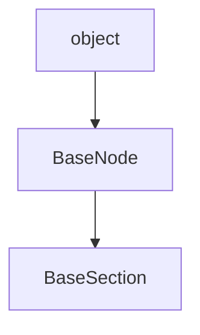

## DocStrings

::: markdownizer..BaseSection

## Child classes

|Class|Module|Description|
|--|----|--|
|[Text](Text.md)|markdownizer.basesection|Class for any Markup text.|
|[Document](Document.md)|markdownizer.document||
|[Image](Image.md)|markdownizer.image||
|[List](List.md)|markdownizer.list||
|[Table](Table.md)|markdownizer.table||
|[Nav](Nav.md)|markdownizer.nav||

## Inheritance diagram

