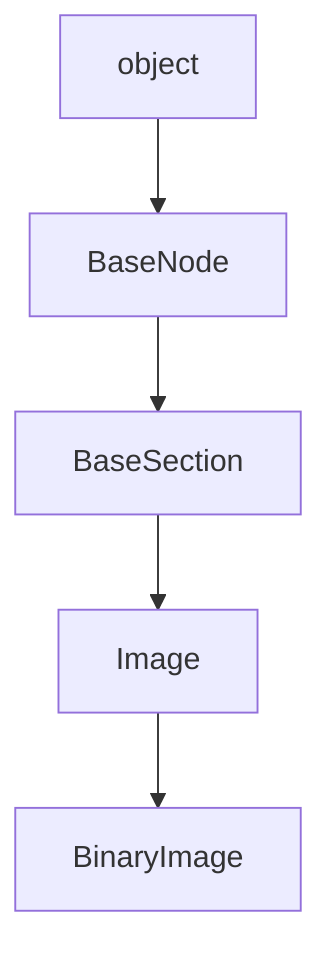

## DocStrings

::: markdownizer..BinaryImage

## Inheritance diagram

```mermaid
graph TD
  object
  BinaryImage
  BaseNode
  BaseSection
  Image
  BaseNode --> BaseSection
  Image --> BinaryImage
  BaseSection --> Image
  object --> BaseNode
```
