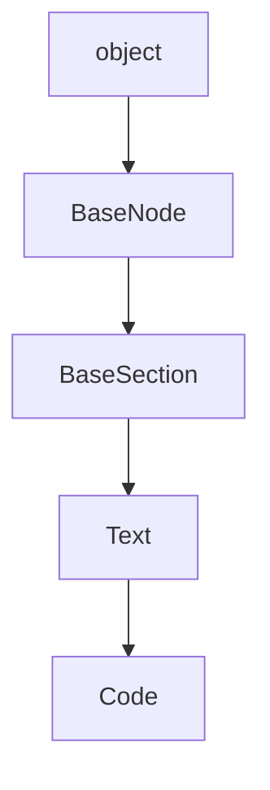

## DocStrings

::: markdownizer..Code

## Child classes

|Class|Module|Description|
|--|----|--|
|[MermaidDiagram](MermaidDiagram.md)|markdownizer.mermaiddiagram||
|[MermaidMindMap](MermaidMindMap.md)|markdownizer.mermaiddiagram||

## Inheritance diagram

