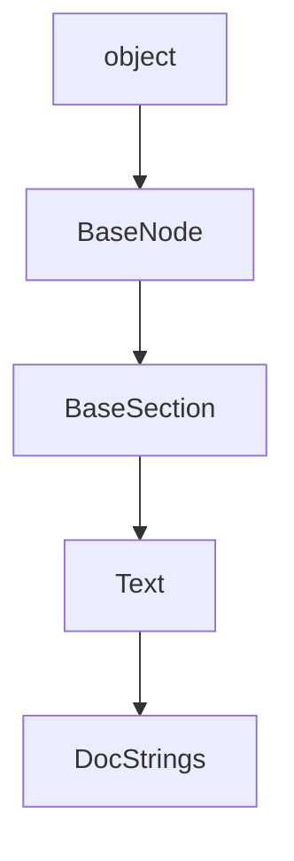

## DocStrings

::: markdownizer..DocStrings

## Inheritance diagram

```mermaid
graph TD
  object
  DocStrings
  BaseNode
  BaseSection
  Text
  BaseNode --> BaseSection
  Text --> DocStrings
  BaseSection --> Text
  object --> BaseNode
```
