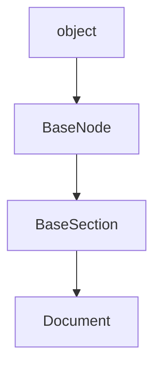

## DocStrings

::: markdownizer..Document

## Child classes

|Class|Module|Description|
|--|----|--|
|[ClassDocument](ClassDocument.md)|markdownizer.document||
|[ModuleDocument](ModuleDocument.md)|markdownizer.document|Document showing info about a module.|

## Inheritance diagram

