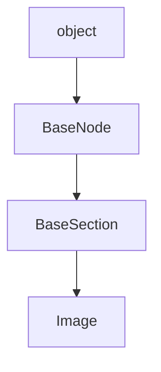

## DocStrings

::: markdownizer..Image

## Child classes

|Class|Module|Description|
|--|----|--|
|[BinaryImage](BinaryImage.md)|markdownizer.image||

## Inheritance diagram

```mermaid
graph TD
  BaseSection
  Image
  BaseNode
  object
  BaseNode --> BaseSection
  BaseSection --> Image
  object --> BaseNode
```
