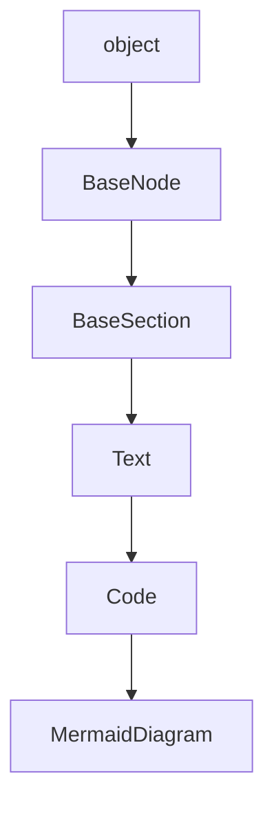

## DocStrings

::: markdownizer..MermaidDiagram

## Inheritance diagram

```mermaid
graph TD
  object
  Code
  BaseNode
  BaseSection
  Text
  MermaidDiagram
  object --> BaseNode
  Text --> Code
  Code --> MermaidDiagram
  BaseSection --> Text
  BaseNode --> BaseSection
```
