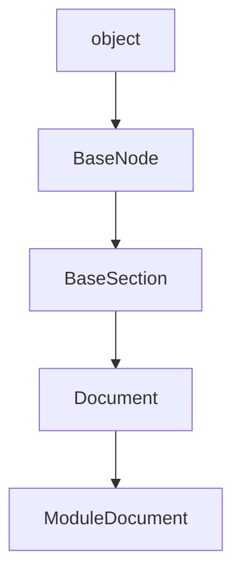

## DocStrings

::: markdownizer..ModuleDocument

## Inheritance diagram

```mermaid
graph TD
  object
  Document
  ModuleDocument
  BaseNode
  BaseSection
  BaseNode --> BaseSection
  BaseSection --> Document
  Document --> ModuleDocument
  object --> BaseNode
```
