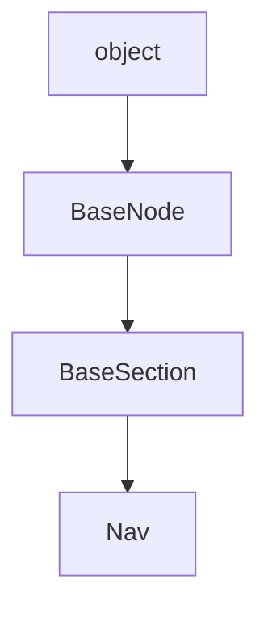

## DocStrings

::: markdownizer..Nav

## Child classes

|Class|Module|Description|
|--|----|--|
|[Docs](Docs.md)|markdownizer.docs||

## Inheritance diagram

```mermaid
graph TD
  Nav
  BaseSection
  BaseNode
  object
  BaseSection --> Nav
  BaseNode --> BaseSection
  object --> BaseNode
```
