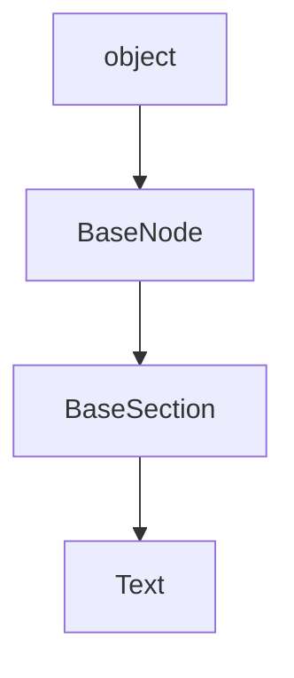

## DocStrings

::: markdownizer..Text

## Child classes

|Class|Module|Description|
|--|----|--|
|[Code](Code.md)|markdownizer.basesection|Class representing a Code block.|
|[Admonition](Admonition.md)|markdownizer.admonition||
|[DocStrings](DocStrings.md)|markdownizer.docstrings||

## Inheritance diagram

