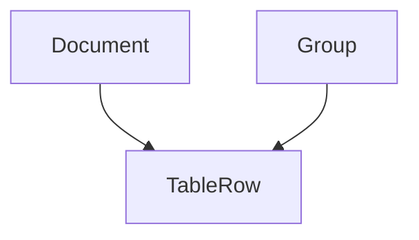

# nweb for Python

## ORM

Basisklasse für Datensaetze: `TableRow` mit den Spzialisierungen `Document` und `Group`

```mermaid
graph TD;
  Document-->TableRow;
  Group-->TableRow;
```

TableRow
 - `__init__(table_name, id, connection)`
 
 
 